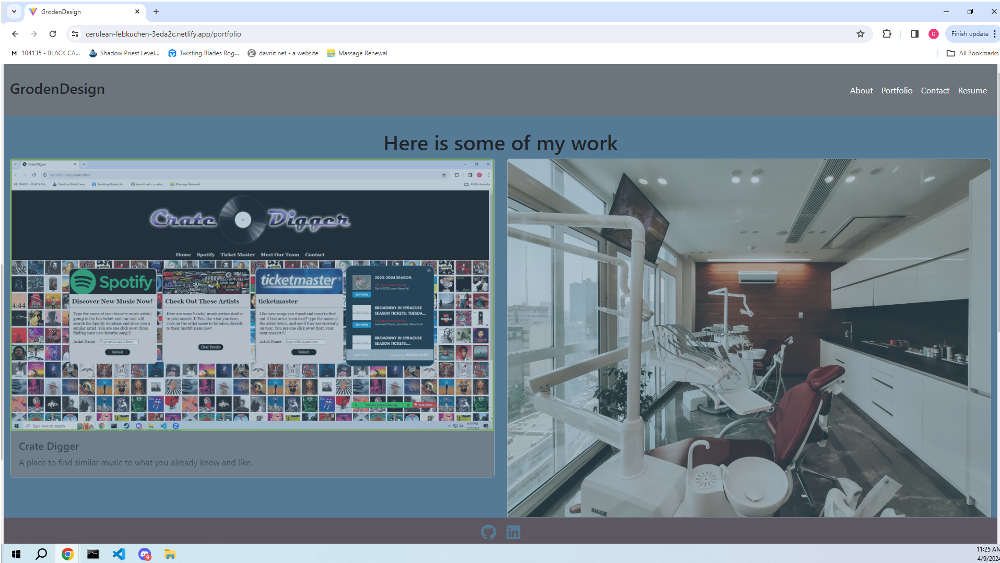

# IwaslikePortfolio

[GrodenDesign](https://cerulean-lebkuchen-3eda2c.netlify.app/)

## Table of Contents
  * [Photo](#photo)
  * [Description](#description)
  * [Future Development](#future-development)
  * [Collaboration](#collaboration)
  * [Installation](#installation)
  * [Contact](#contact)

## Photo

## Description
This is the webpage for my projects.

## Future Development
* Adding more advanced projects to the portfolio.
* Finishing the contact card.

## Collaboration
Feel free to use this as you please.  

## Installation
* For installation you must `npm init`.
* Use `npm install` to install dependencies.
* Use `npm start` to start the server, or deploy to heroku or render etc.

## Contact
[Github](https://github.com/Spaghedward)